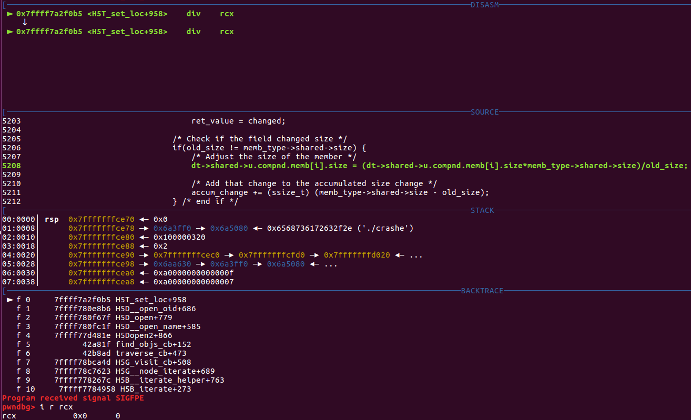
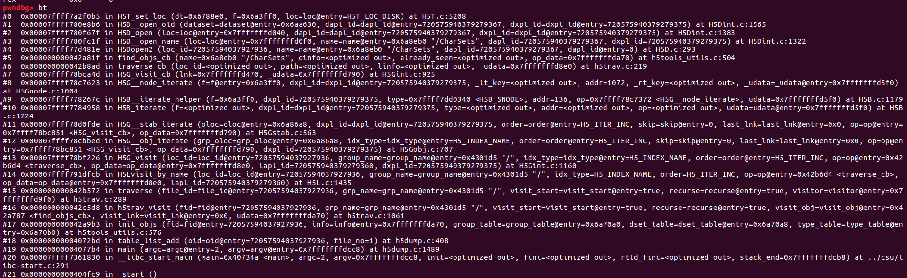
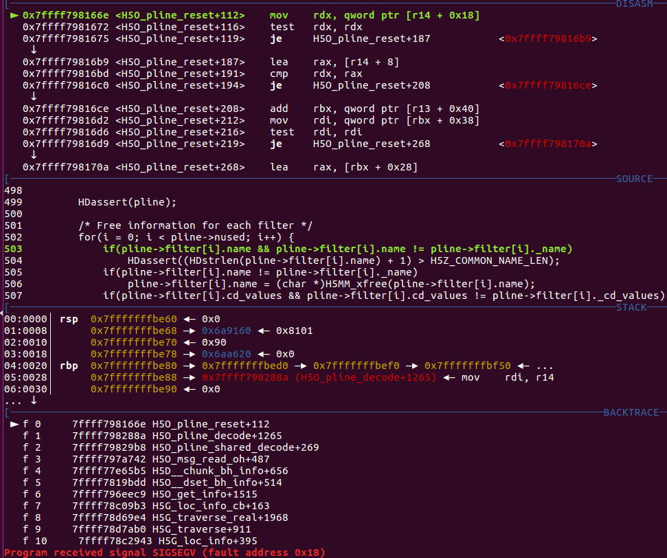
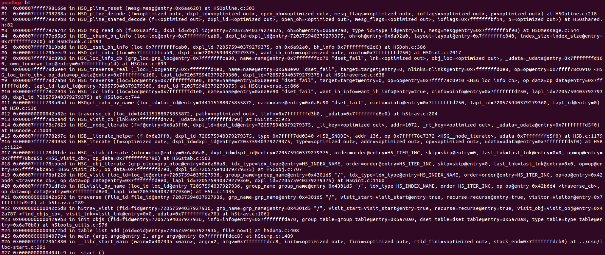
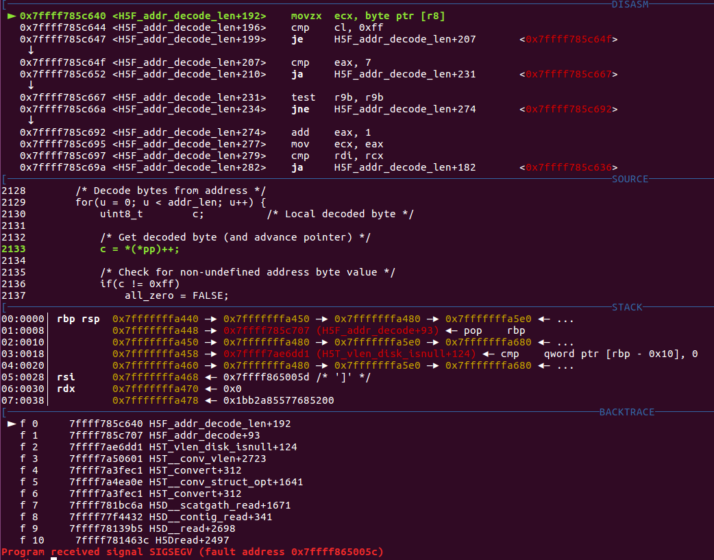
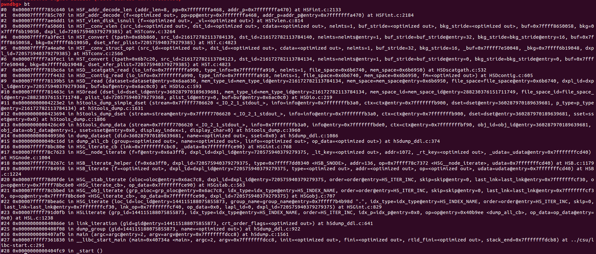
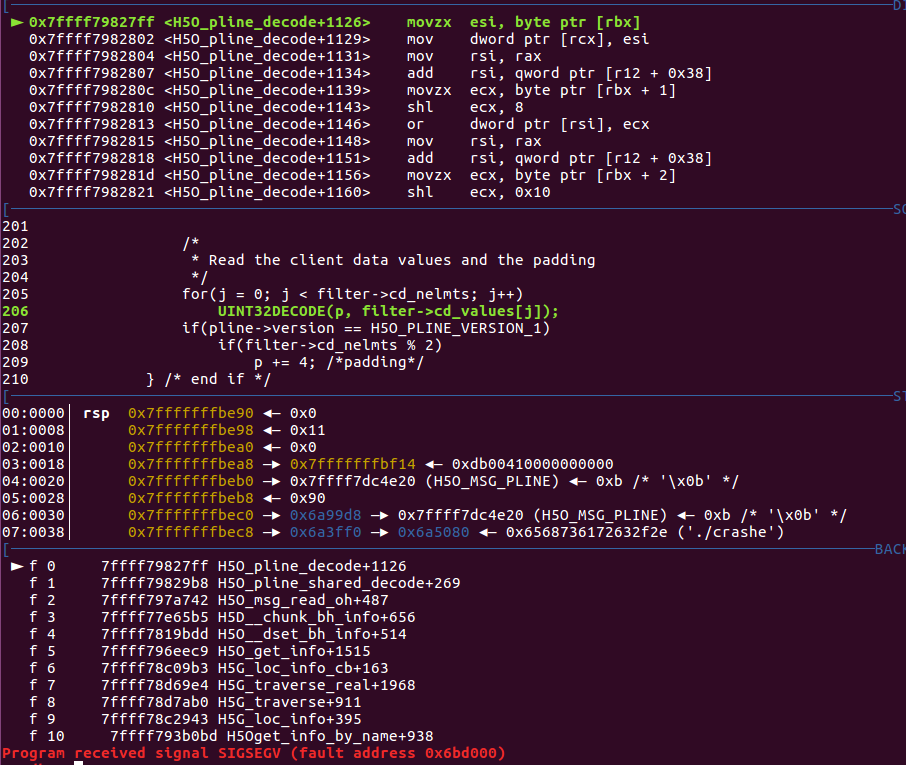
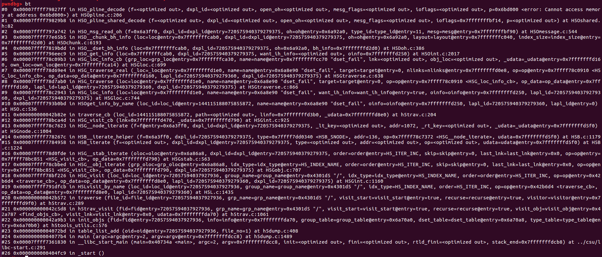
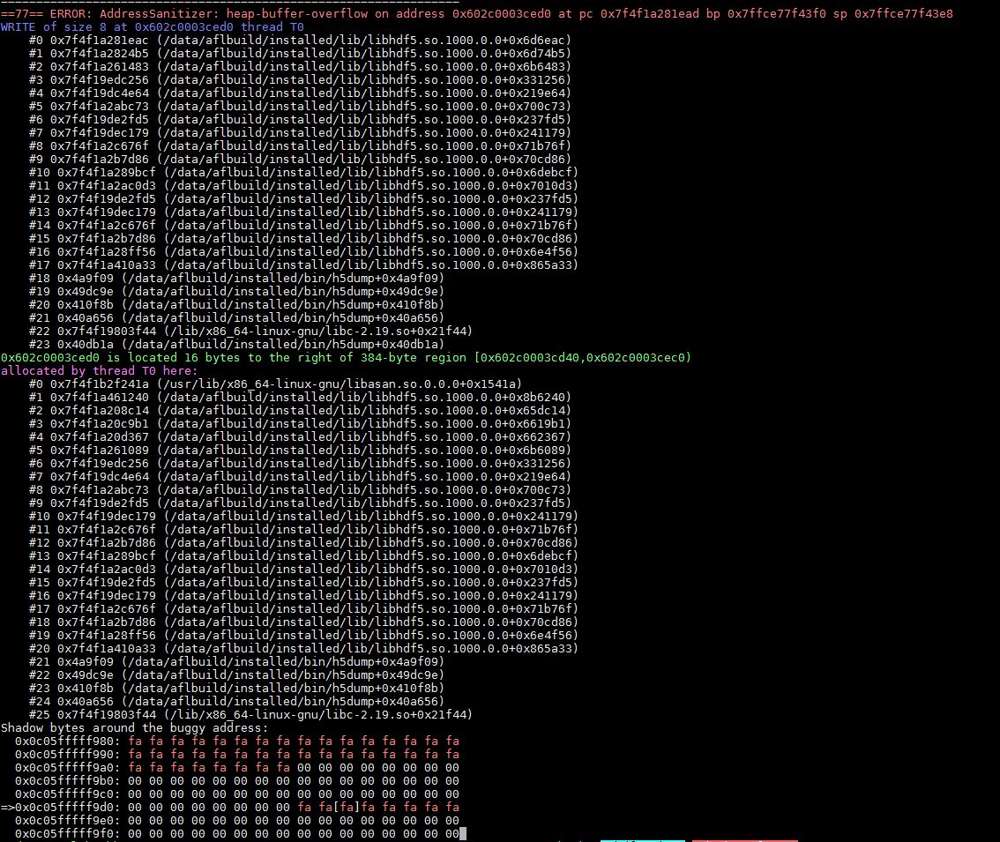

hdf5 pocs
=============

## 1-hdf5-divbyzero-H5T_set_loc  

./hdf5dump 1-hdf5-divbyzero-H5T_set_loc

## 2-hdf5-null-pointer-H5O_pline_decode  

./hdf5dump 2-hdf5-null-pointer-H5O_pline_decode  

## 3-hdf5-outbound-read-H5T_conv_struct_opt  

./hdf5dump 3-hdf5-outbound-read-H5T_conv_struct_opt  

## 4-hdf5-outbound-read-H5Opline_pline_decode  

./hdf5dump 4-hdf5-outbound-read-H5Opline_pline_decode  

## 5-hdf5-heap-overflow-H5G__ent_decode_vec 

./hdf5dump 5-hdf5-heap-overflow-H5G__ent_decode_vec

