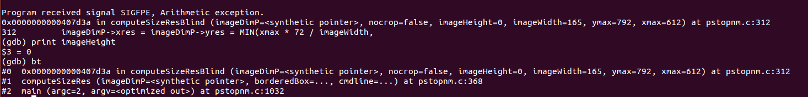

pocs of netpbm 
========================

## 1. pstopnm-divbyzero-1

A divided by zero results to dos in pstopnm tool. 
the bug is in computeSizeResBlind function because of imageHeight is zero. 

## 2. pstopnm-divbyzero-2

